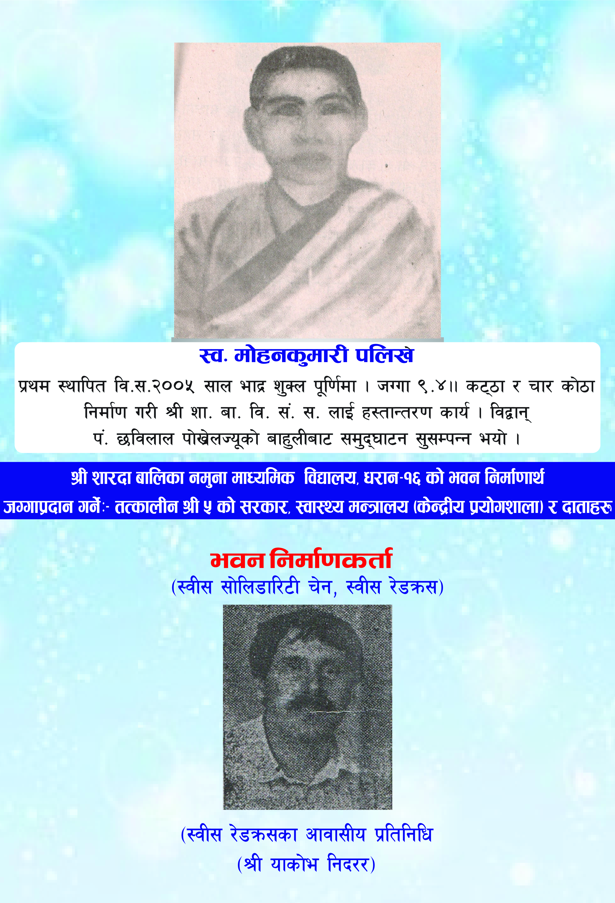
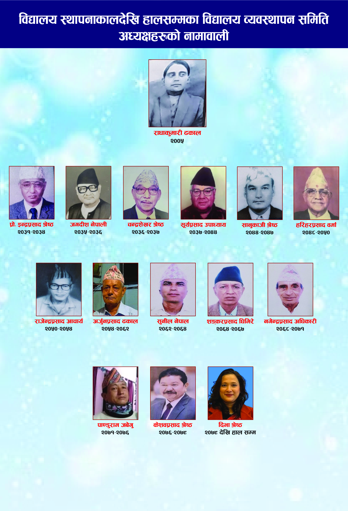
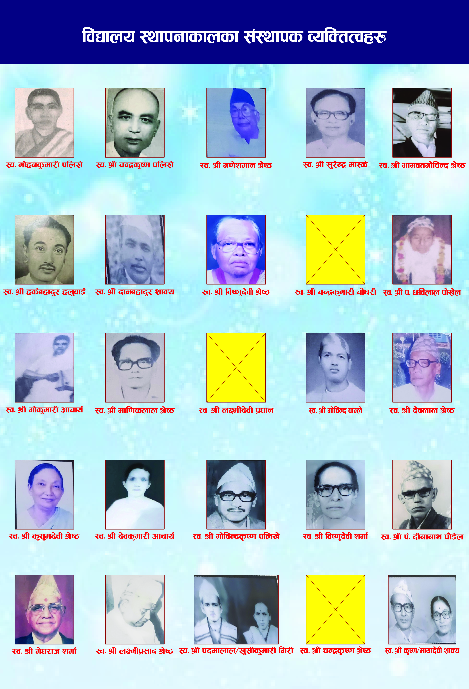
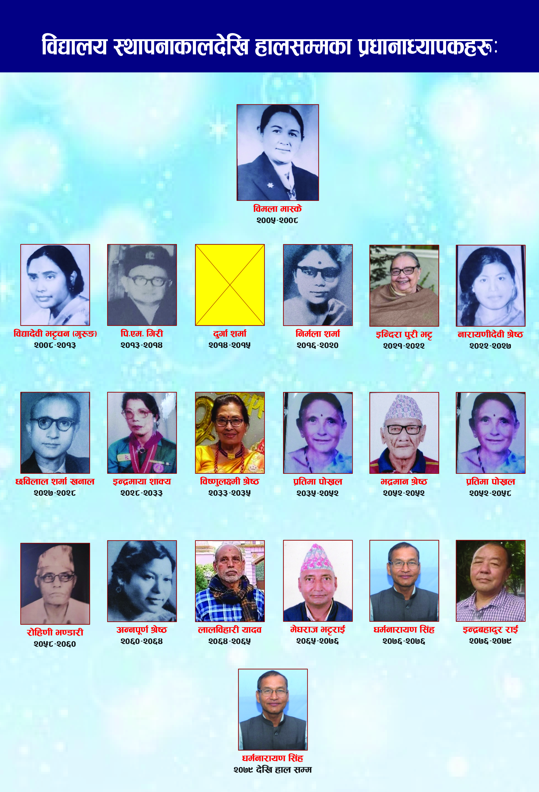

वि.सं. २००५ (सन् १९४८) मा स्थापित यो विद्यालय पूर्वी नेपालकै अग्रणी तथा ऐतिहासिक सामुदायिक बालिका विद्यालय हो।

महिला शिक्षामा पूर्ण रूपमा समर्पित यस विद्यालयमा छात्रा मात्र अध्ययन गर्दछन्। गुणस्तरीय तथा सर्वसुलभ शिक्षा प्रदान गरी छात्राहरूलाई सशक्त बनाउनु हाम्रो मुख्य ध्येय हो।

