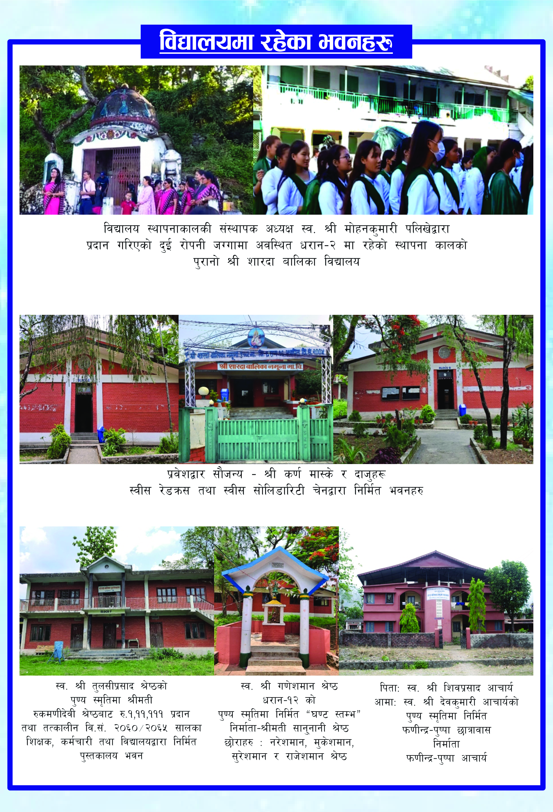
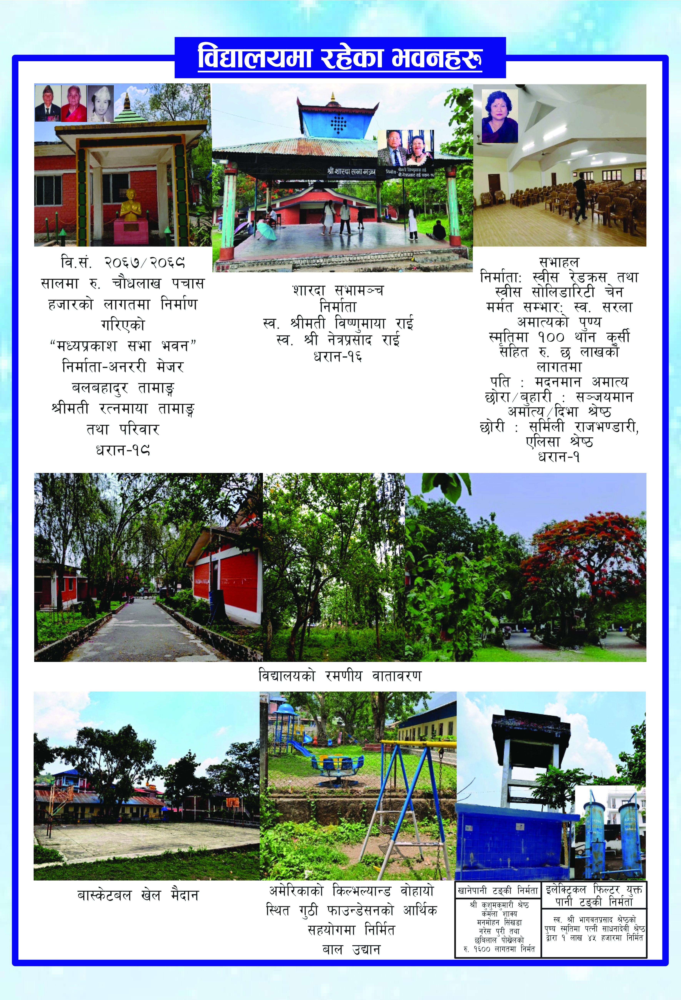

धरान-१६ स्थित विद्यालयमा आधुनिक विज्ञान प्रयोगशाला, कम्प्युटर ल्याब, समृद्ध पुस्तकालय, मल्टिमिडिया कक्षा, नृत्य तथा संगीत कक्ष, क्यान्टिन र खेल मैदान उपलब्ध छन्।

सुलभ शुल्क संरचनाका साथै जेहेन्दार तथा विपन्न छात्राहरूका लागि विभिन्न छात्रवृत्तिको व्यवस्था गरिएको छ।

